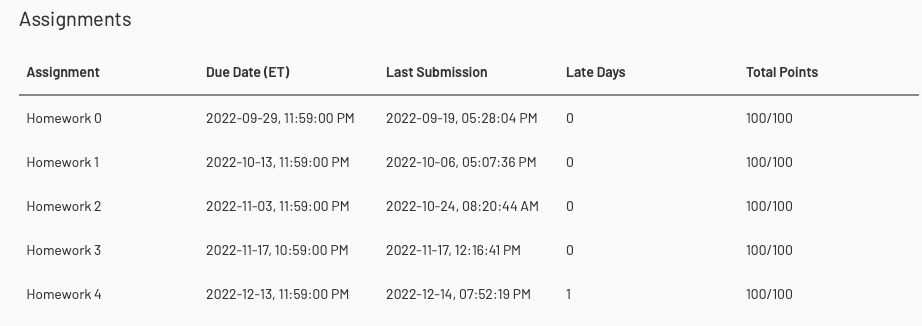
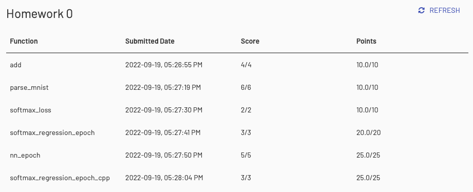
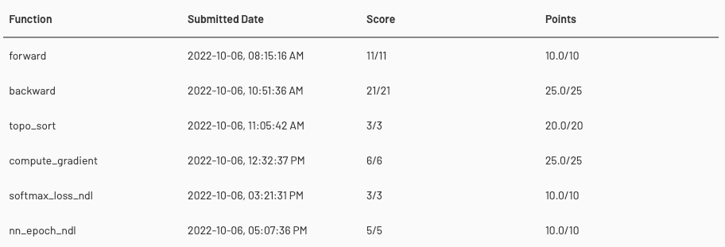
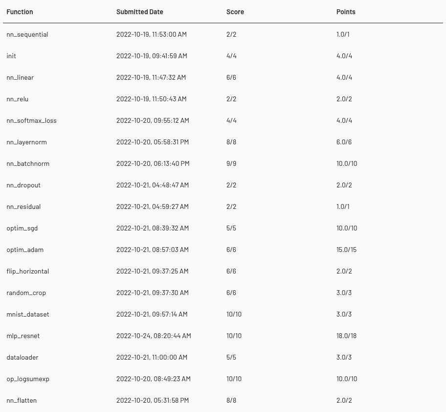
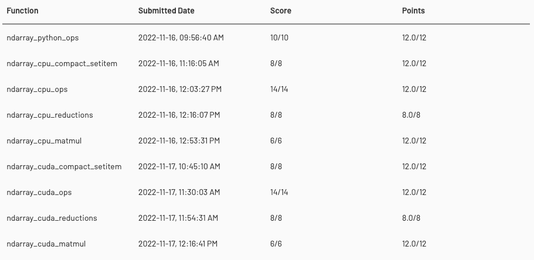
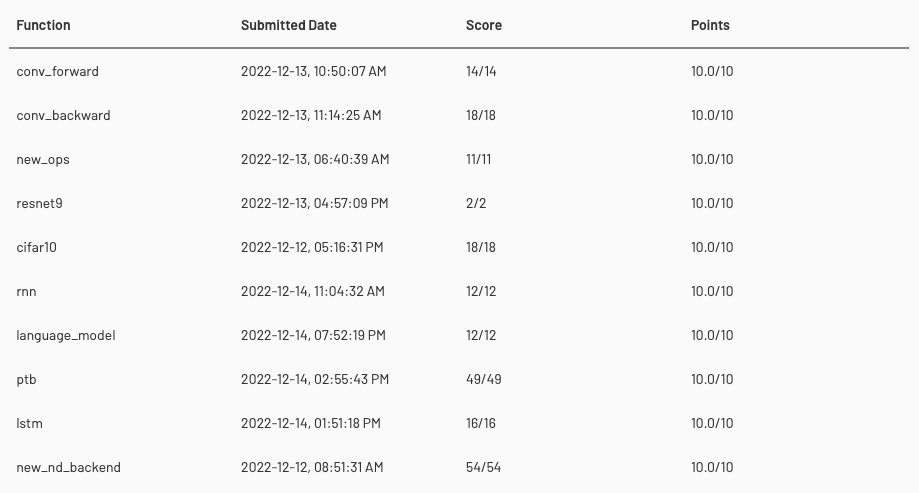

# 10-714 DLSYS 2022

## Information

- [Course Description](https://dlsyscourse.org)
- [Assignments](https://dlsyscourse.org/assignments/)
- [Lectures and Slides](https://dlsyscourse.org/lectures/)
- [Forum](https://forum.dlsyscourse.org)

## clone a git repository as a subdirectory

### new update: `fetch.sh`

automatically clone the homework repository as subdirectory.

``` bash
# fetch homework repository example
bash fetch.sh hw4
```

### subfolder repo

1. `fork` the homework repository (e.g. `hw3`) and `clone` to local
2. move all of the content to a subfolder
3. `git add hw3`  and `git commit -m "Add hw3"`
4. `git push remote origin`

### main repo

1. `git remote add hw3 git@github.com:amomorning/hw3.git`
2. `git fetch hw3`
3. `git merge hw3/main --allow-unrelated-histories`
4. `git remote rm hw3`

## Setup environments

for python just follow the `*.ipynb`

``` bash
# how to connect c++ to python
```

## Result

### Summary



### Homework 0



### Homework 1



### Homework 2



### Homework 3



### Homework 4


